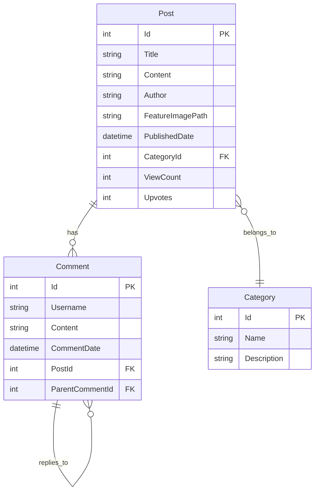

<p align="center">
  <h1 align="center">💬 Discussion Forum</h1>
  <p align="center">
    A modern, full-featured discussion forum built with ASP.NET Core MVC
    <br />
    <a href="https://github.com/Krijhonia/Discussion-Forum"><strong>View on GitHub »</strong></a>
  </p>
</p>

<p align="center">
  
  
  
  
  
</p>

---

## ✨ Features

### Core Functionality
- **📝 Create & Manage Posts** — Write discussion posts with a rich text editor, categorize them, and attach feature images
- **💬 Nested Comments** — Threaded comment system with support for replies to foster engaging conversations
- **📂 Categories** — Organize discussions into categories for easy browsing and filtering
- **🔍 Search & Filter** — Search posts by title/content, filter by category, and sort by latest, popular, or most viewed
- **👤 User Profiles** — View user profiles with their post history and activity

### Rich Text Editor
- **TipTap-powered Editor** — Modern WYSIWYG editing experience with:
  - Bold, Italic, Underline, Strikethrough formatting
  - Headings (H1, H2, H3)
  - Bullet & Ordered lists
  - Code blocks with syntax highlighting
  - Blockquotes
  - Horizontal rules
  - Undo / Redo support

### User Experience
- **🌙 Dark / Light Theme** — Toggle between dark and light modes with persistent preference
- **📱 Fully Responsive** — Works seamlessly on desktop, tablet, and mobile devices
- **⬆️ Upvote System** — Upvote posts to surface the best content
- **👁️ View Counter** — Track post popularity with automatic view counting
- **🖼️ Image Uploads** — Upload feature images for posts with file validation
- **🔐 Authentication** — Full user registration, login, and logout powered by ASP.NET Identity

---

## 🛠️ Tech Stack

| Layer | Technology |
|-------|-----------|
| **Framework** | ASP.NET Core MVC (.NET 10) |
| **Language** | C# |
| **Database** | PostgreSQL |
| **ORM** | Entity Framework Core 10 |
| **Authentication** | ASP.NET Core Identity |
| **Frontend** | Bootstrap 5 (Bootswatch theme), Vanilla JS |
| **Rich Text Editor** | Custom TipTap-style contentEditable editor |
| **Syntax Highlighting** | highlight.js |
| **Icons** | Bootstrap Icons |
| **Fonts** | Google Fonts (Inter) |

---

## 📁 Project Structure

```
Discussion Forum/
├── Controllers/
│   ├── AccountController.cs      # Authentication (Login, Register, Logout)
│   ├── HomeController.cs         # Landing page & navigation
│   ├── PostController.cs         # CRUD operations for posts, comments, upvotes
│   └── ProfileController.cs     # User profile management
├── Data/
│   └── AppDbContext.cs           # EF Core database context
├── Migrations/                   # EF Core database migrations
├── Models/
│   ├── Category.cs               # Category entity
│   ├── Comment.cs                # Comment entity (supports nesting)
│   ├── Post.cs                   # Post entity with upvotes & view count
│   ├── Helpers/                  # Utility/helper classes
│   └── ViewModels/               # View-specific models
├── Views/
│   ├── Account/                  # Login & Register views
│   ├── Home/                     # Landing page
│   ├── Post/                     # Create, Edit, Detail, Index views
│   ├── Profile/                  # User profile view
│   └── Shared/                   # Layout, partials, view components
├── ViewComponents/               # Reusable view components
├── wwwroot/
│   ├── css/site.css              # Custom styles (dark/light theme, animations)
│   ├── js/
│   │   ├── site.js               # Theme toggle, interactions
│   │   └── tiptap-editor.js      # Rich text editor implementation
│   ├── images/                   # Static images
│   └── uploads/                  # User-uploaded files
├── Program.cs                    # Application entry point & service configuration
├── appsettings.json              # Configuration
└── Discussion Forum.csproj       # Project file & dependencies
```

---

## 🚀 Getting Started

### Prerequisites

- [.NET 10 SDK](https://dotnet.microsoft.com/download/dotnet/10.0)
- [PostgreSQL](https://www.postgresql.org/download/) (v14 or later recommended)
- A code editor like [Visual Studio](https://visualstudio.microsoft.com/) or [VS Code](https://code.visualstudio.com/)

### Installation

1. **Clone the repository**
   ```bash
   git clone https://github.com/Krijhonia/Discussion-Forum.git
   cd Discussion-Forum
   ```

2. **Configure the database connection**

   Update the connection string in `Discussion Forum/appsettings.json`:
   ```json
   {
     "ConnectionStrings": {
       "DefaultConnection": "Host=localhost;Database=DiscussionForum;Username=your_username;Password=your_password"
     }
   }
   ```

3. **Apply database migrations**
   ```bash
   cd "Discussion Forum"
   dotnet ef database update
   ```

4. **Run the application**
   ```bash
   dotnet run
   ```

5. **Open in browser**

   Navigate to `https://localhost:5001` or `http://localhost:5000`

---

## 🗄️ Database Schema



---

## 🎨 Themes

The forum supports both **dark** and **light** themes. Users can toggle between themes using the moon/sun icon in the navbar. The preference is persisted in `localStorage`.

---

## 🤝 Contributing

Contributions are welcome! Feel free to:

1. Fork the repository
2. Create a feature branch (`git checkout -b feature/amazing-feature`)
3. Commit your changes (`git commit -m 'Add some amazing feature'`)
4. Push to the branch (`git push origin feature/amazing-feature`)
5. Open a Pull Request

---

## 📄 License

This project is licensed under the **GPL-3.0 License** — see the [LICENSE](LICENSE) file for details.

---

<p align="center">
  Made with ❤️ by <a href="https://github.com/Krijhonia">Krijhonia</a>
</p>
